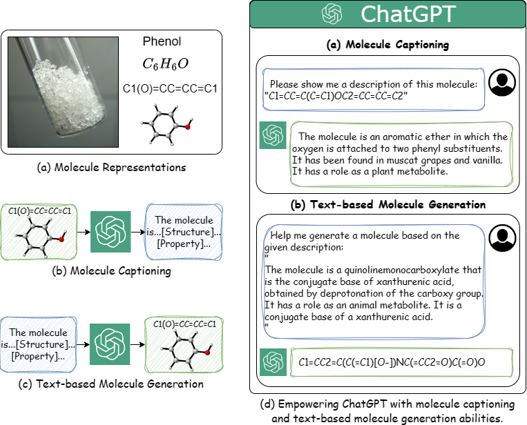
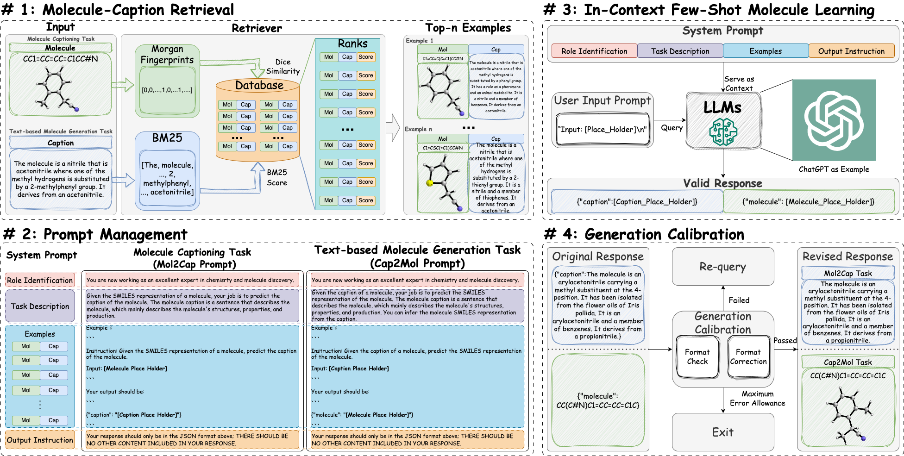

# MolReGPT: Empowering Molecule Discovery for Molecule-Caption Translation with Large Language Models: A ChatGPT Perspective

The official repo of `MolReGPT` - **"Empowering Molecule Discovery for Molecule-Caption Translation with Large Language Models: A ChatGPT Perspective"**. ([Available through Arxiv Link](https://arxiv.org/abs/2306.06615)) 

### Author List
| Name | Affiliation | Email |
| :---: | :---: | :---: |
| [Jiatong Li](https://phenixace.github.io/) | The Hong Kong Polytechnic University | jiatong.li@connect.polyu.hk |
| [Yunqing Liu](https://liuyunqing.github.io/) | The Hong Kong Polytechnic University | yunqing617.liu@connect.polyu.hk |
| [Wenqi Fan](https://wenqifan03.github.io/) | The Hong Kong Polytechnic University | wenqifan03@gmail.com |
| [Xiao-Yong Wei](https://www4.comp.polyu.edu.hk/~x1wei/) | The Hong Kong Polytechnic University & Sichuan University | x1wei@polyu.edu.hk |
| Hui Liu | Michigan State University | liuhui7@msu.edu |
| [Jiliang Tang](https://cse.msu.edu/~tangjili/) | Michigan State University | tangjili@msu.edu |
| [Qing Li](https://www4.comp.polyu.edu.hk/~csqli/) | The Hong Kong Polytechnic University | qing-prof.li@polyu.edu.hk |

### Contact
If you encounter any problems, please feel free to contact us.


## News
Codes, data, and demo will be available soon~ We will follow our roadmap to release the results. Please stay tuned!

### In the first phase:
Our paper is available through Arxiv~ 🎉

We first released the results of [zero_shot](./dataset/cap_mol_trans/zero_shot/) and ten shot results [ten_shot_bm25](./dataset/cap_mol_trans/ten_shot_bm25/), [ten_shot_morgan](./dataset/cap_mol_trans/ten_shot_morgan/).

The remaining results will be gradually released. Thanks for your patience!

### In the second phase and later:

Secret Now! 🤫 We will release our plan~ 😄

## Introduction
MolReGPT aims to create a foundation method for molecule discovery by leveraging large language models (LLMs). 
Thus, we focus on two crucial aspects: 
1. molecule understanding
2. text-conditioned molecule generation 

[](./figs/intro.png)

To this end, we focus on a specific task, `molecule-caption translation`, the two sub-tasks of which exactly corresponds to the two aspects. 
1. `molecule2caption (i.e., Mol2Cap)` aims to generate a caption for a given molecule to describe its structure, properties, and functions.
2. `caption2molecule (i.e., Cap2Mol)` aims to generate a molecule for a given caption, which could help researchers customize their molecules for specific purposes.


### Abstract
Molecule discovery plays a crucial role in various scientific fields, advancing the design of tailored materials and drugs. Traditional methods for molecule discovery follow a trial-and-error process, which are both time-consuming and costly, while computational approaches such as artificial intelligence (AI) have emerged as revolutionary tools to expedite various tasks, like molecule-caption translation. Despite the importance of molecule-caption translation for molecule discovery, most of the existing methods heavily rely on domain experts, require excessive computational cost, and suffer from poor performance. On the other hand, Large Language Models (LLMs), like ChatGPT, have shown remarkable performance in various cross-modal tasks due to their great powerful capabilities in natural language understanding, generalization, and reasoning, which provides unprecedented opportunities to advance molecule discovery. To address the above limitations, in this work, we propose a novel LLMs-based framework (**MolReGPT**) for  molecule-caption translation, where a  retrieval-based prompt paradigm is introduced to empower molecule discovery with LLMs like ChatGPT without fine-tuning. More specifically, MolReGPT leverages the principle of molecular similarity to retrieve similar molecules and their text descriptions from a local database to ground the generation of LLMs through in-context few-shot molecule learning. We evaluate the effectiveness of MolReGPT via molecule-caption translation, which includes molecule understanding and text-based molecule generation. Experimental results show that MolReGPT outperforms fine-tuned models like MolT5-base without any additional training. To the best of our knowledge, MolReGPT is the first work to leverage LLMs in molecule-caption translation for advancing molecule discovery.


### Model Strcuture
[](./figs/model_structure.png)


### Dataset
We apply the same dataset used in MolT5, which is the dataset of [ChEBI-20](./dataset/cap_mol_trans/raw/)

### Results

Results have been released!👏

#### Mol2Cap
| Method | BLEU-2 $\uparrow$ | BLEU-4 $\uparrow$| ROUGEL-1 $\uparrow$| ROUGEL-2 $\uparrow$ | ROUGEL-L $\uparrow$ | METEOR $\uparrow$ | Text2Mol $\uparrow$ |
| :---: | :---: | :---: | :---: | :---: | :---: | :---: | :---: |
| Transformer | 0.061 | 0.027 | 0.204 | 0.087 | 0.186 | 0.114 | 0.057 |
| T5-base | 0.511 | 0.423 | 0.607 | *0.451* | *0.550* | 0.539 | 0.523 |
| MolT5-base | *0.540* | *0.457* | **0.634** | **0.485** | **0.578** | *0.569* | *0.547* |
| GPT-3.5-turbo (zero_shot) | 0.103 | 0.050 | 0.261 | 0.088 | 0.204 | 0.161 | 0.352 |
| MolReGPT | **0.565** | **0.482** | *0.623* | 0.450 | 0.543 | **0.585** | **0.560** |


#### Cap2Mol
| Method | BLEU $\uparrow$ | EM $\uparrow$ | Levenshtein $\downarrow$ | MACCS FTS $\uparrow$ | RDK FTS $\uparrow$ | Morgan FTS $\uparrow$  | FCD $\downarrow$ | Text2Mol $\uparrow$ | Validity $\uparrow$ |
| :---: | :---: | :---: | :---: | :---: | :---: | :---: | :---: | :---: | :---: |
| Transformer | 0.499 | 0.000 | 57.66 | 0.480 | 0.320 | 0.217 | 11.32 | 0.277 | **0.906** |
| T5-base | 0.762 | 0.069 | 24.950 | *0.731* | *0.605* | *0.545* | 2.48 | *0.499* | 0.660 |
| MolT5-base | *0.769* | *0.081* | **24.458** | 0.721 | 0.588 | 0.529 | *2.18* | 0.496 | 0.772|
| GPT-3.5-turbo (zero_shot) | 0.489 | 0.019 | 52.13 | 0.705 | 0.462 | 0.367 | 2.05 | 0.479 | 0.802 |
| MolReGPT | **0.790** | **0.139** | *24.91* | **0.847** | **0.708** | **0.624** | **0.57** | **0.571** | *0.887* |


## Requirements

```
transformers == 4.30.0
torch == 1.13.1+cu117
rdkit == 2022.09.5
fcd == 1.1
rank_bm25 == 0.2.2
sentence_transformers == 2.2.2
openai == 0.27.2
```

## Usage

```
Thanks for your attention! The codes will be released ASAP!
```

## Demo

Currently, you can customize your own prompt via our released [jupyter-notebook demo](./inference.ipynb)

We will also provide web-page for a more user-friendly demo.

## Citation
```
@article{molregpt,
  title={Empowering Molecule Discovery for Molecule-Caption Translation with Large Language Models: A ChatGPT Perspective},
  author={Jiatong Li and Yunqing Liu and Wenqi Fan and Xiao-Yong Wei and Hui Liu and Jiliang Tang and Qing Li},
  journal={arXiv preprint arXiv:2306.06615},
  year={2023}
}
```
